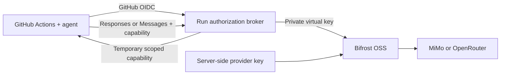

# Provider-key custody: live CI spike

**Date:** 2026-09-30. **Result:** feasible, with three real successful GitHub Actions reviews. **Scope:** disposable project only; no ReviewRouter production feature or deployment changed.

## What was proved

A provider master key can remain on our backend while CI runs the agent and its code-reading tools. Actions authenticates with GitHub OIDC, obtains a short-lived scoped capability, and sends inference through a private broker and ready OSS Bifrost. Bifrost supplies the provider key server-side.

The credential boundary is agent independent. Codex uses Responses; Claude Code uses Anthropic Messages. A future client still needs a compatible protocol/configuration profile and a canary. This is not a promise that every proprietary client feature works automatically.

The CI capability remains a secret, but it is not the provider master key. In this spike it is pinned to repository/workflow SHA, run/attempt, provider/model/protocol; it lasts no longer than the OIDC expiry and has request/concurrency/body limits. An authorized malicious job can consume its own grant until expiry; production needs tenant budgets and policy, not just hidden key bytes.

## Real accepted runs

All three ran the actual installed CLI, actually read the sealed fixture with successful tools, and reported the missing negative-withdrawal guard with correct balance arithmetic. The prompt did not name the bug. Only normalized evidence was uploaded.

| Actual agent/provider | Model | Actions result | Code SHA |
|---|---|---|---|
| Codex + MiMo Token Plan | mimo-v2.6-pro | [SUCCESS 36741594269](https://github.com/777genius/rr-selfhost-direct-v2-e2e-20260730t115357z/actions/runs/36741594269) | d836d5237e98fcf72e7ca15fee0516cf907740da |
| Codex + OpenRouter | openai/gpt-4.1 | [SUCCESS 36747901266](https://github.com/777genius/rr-selfhost-direct-v2-e2e-20260730t115357z/actions/runs/36747901266) | dd0af155671e2524bb49518c1fe8270338ddb1ff |
| Claude Code + MiMo Token Plan | mimo-v2.6-pro | [SUCCESS 36747904837](https://github.com/777genius/rr-selfhost-direct-v2-e2e-20260730t115357z/actions/runs/36747904837) | dd0af155671e2524bb49518c1fe8270338ddb1ff |

Exact CLI versions: Codex **0.159.2**, Claude Code **2.1.285**, Node **24.21.0**. There are 14 focused behavioral tests, passed in the final Actions runs. Test contracts cover real cryptographic OIDC validation, expiry/replay/revocation, provider/key/model isolation, route/header control, resource limits, streaming failure/cancellation and evidence false positives.

Repository: **777genius/rr-selfhost-direct-v2-e2e-20260730t115357z**, immutable ID **1317214237**, owner ID **13103045**. Reused an existing disposable E2E repository. Original main was fd3c196769705a69efba0e44fc976e1e8fc4bc98. Only a new manually dispatched workflow and gateway-spike source were added; legacy workflows were preserved.

## Failures discovered and resolved

There were 14 deliberate dispatches: 3 accepted runs and 11 terminal failures. Failed reviews were not treated as success. Each outcome was inspected before a remedial attempt.

| Finding | Evidence / resolution |
|---|---|
| Codex sends client_metadata | Runs 36738466075 and 36738470750 denied at the strict broker field boundary. Accept then strip this non-routing field. |
| Docker host cannot create nested Codex bwrap sandbox | Runs 36739543498 and 36739547742 reached inference but could not execute tools. Use a disposable unprivileged outer container and root-owned sealed fixture; no host sandbox/sysctl weakening. |
| Smaller OpenRouter model produced an incorrect example or missed the required negative case | Runs 36741599934 and 36742629683. Evidence validator correctly stayed red. Choose a more capable explicit canary model. |
| Claude variadic MCP option consumed the prompt | Run 36742634493. Separate positional prompt using --. |
| Claude SDK adds exact ?beta=true to Messages | Run 36743610432. Permit only this exact variant; other query/routing parameters remain denied. |
| OpenRouter gpt-6.1-sol upstream rate limit | Runs 36743605329 and 36745544784 read code and executed the correct reproduction but failed the final inference. Select available GPT-4.1 explicitly; no automatic fallback. |
| Bifrost Messages ingress internally checks responses_stream | Run 36745549924. Enable responses and responses_stream on the anthropic custom provider, both targeting /anthropic/v1/messages. The subsequent real Claude run passed. |

Bifrost handles compatibility complexity that we otherwise would own. It is not perfectly transparent: synthetic upstream response.failed became HTTP 400 JSON. An actual Codex error-contract probe exited 1, observed an error and did not report completion. Truncated upstream responses returned failure; upstream 503 remained a failure. Keep those semantic contracts when upgrading the gateway.

## Key custody and isolation evidence

- Provider keys were read only by trusted server-side setup/scan scripts from existing root-only files. No key value or hash was returned to the model, browser, local machine or worker.
- Provider keys existed in the gateway's server environment and encrypted private config database. Broker held only its own admin session and per-run virtual keys. The runner received neither.
- Actual runner probe: broker health 200, admin path 404, forged grant 401, direct gateway control address unreachable, host secret file absent.
- Fourteen complete exported runner filesystems plus their configuration/logs, all fourteen complete Actions logs, three published normalized artifacts, source bundle, registration logs, and own broker/gateway logs were scanned against both actual master keys on the server. **Zero matches** across **34,997,994,267 uncompressed bytes / 76 inputs**.
- Runners had no host mounts, Docker socket or published host ports. Agents had a clean temporary home and allowlisted environment without parent OIDC runtime auth or subscription credentials.
- Test fixture root ownership/read-only mode and source equality were checked before obtaining a grant. Independent probes confirmed read succeeds while write/chmod/rename fail for the runner UID.

See normalized [evidence](evidence/) for custody, isolation, protocol/error, teardown and three successful review receipts. Exact byte scanning proves no observed plaintext master-key leakage in this test's examined surfaces; it is not a formal proof against all possible future side channels.

## Pins and topology

Host **workers-fsn1-01**, machine ID **d856d40da5ad4e23b4f67773e5942842**, IP 176.9.7.209. Isolated scope **review-router-gateway-spike/poc-20260930**. No public DNS, public port, production service or other workstream was changed.

- Bifrost OSS **v2.2.4**, source **ed8371a9779bfbc8aa689d4d77964cf8ce9308bf**.
- Gateway image **maximhq/bifrost@sha256:5f8215163cea192451f4b2ee5e0b583874ffe9435a5ab733e08c07aaf38ace57**.
- Sealed runner image **rr-gateway-spike-runner@sha256:f31d9fb67f3ae84ceac42acb1560c49105b9a9033ef7131bf154c5b12f9d3942**.
- Node base image **node@sha256:0e0ff40c39bc087845bfb27465a0df4ea419520094bc35842ff83dd8cbe6f9b6**.
- Subscription-runtime worker runtime commit **b3a8f4b**.
- Checkout **v7.0.1** at 3d3c42e5aac5ba805825da76410c181273ba90b1; upload-artifact **v7.0.1** at 043fb46d1a93c77aae656e7c1c64a875d1fc6a0a.

Gateway sits on private control + provider-egress networks. Broker sits on control + inference + broker-egress. Runner sits on inference + runner-egress. Gateway admin and inference share a listener but the runner cannot access that network. No public TLS/public GitHub-hosted runner path was tested.

## Effort and measured code

At the successful canary code SHA dd0af15:

| Authored material | Physical lines |
|---|---:|
| Broker + OIDC + clients + evidence parsing | 276 |
| Meaningful behavioral tests | 181 |
| Actions workflow + executable fixture | 49 |
| **Executable source/tests/workflow total** | **506** |

Another 3 lines describe fixture business rules. Server operator Dockerfile/entry script/synthetic upstream add 40 retained lines, excluding ad hoc deployment/probe commands. These counts exclude OSS Bifrost and CLI dependency code. JS is densely formatted, so 276 physical PoC lines are not a production implementation estimate. Documentation, config examples and normalized evidence are counted separately.

First hosted implementation output was available in approximately 6 minutes; its first exported patch took approximately 16 minutes and needed integration/evidence improvements. Recorded plan commit: **14:30:43 UTC**. Teardown: **17:05:13 UTC**, about **2 h 35 min** after that checkpoint; total hands-on session including earlier setup and final report is approximately **3 hours**. Host setup, exact-code reviews and real protocol/CLI debugging dominated elapsed time. Budget roughly **half to one working day** to repeat a bounded spike from scratch with authorized keys, host and gh access ready.

Implementation and independent reviews ran via hosted subscription-runtime with explicitly selected **gpt-6.1-sol**, medium/high reasoning and isolated workspaces. Two revoked worker slots were excluded; healthy configured pool identities continued. The original worker patch was superseded after fixes and not falsely recorded as a passing final output. Final code/deltas had independent hosted review. Coordinator made owner-identity mechanical commits and verified actual Actions/evidence.

## Product delivery estimate and plan

Recommended: **ready OSS Bifrost + a thin ReviewRouter authorization/credential-binding layer**, with separate native client profiles. Avoid building our own protocol translator. A ready gateway cannot know our workspace permissions or repository/run grants; that small application layer remains our responsibility.

The full product must let the user enter/store a provider key in the existing backend vault, bind that credential to one or more repositories, and configure agent/provider/model without copying a master key to GitHub secrets. Batch apply updates credential bindings and workflow configuration. Existing Codex subscription/account-pool relay stays as its own supported credential adapter; do not treat subscription OAuth as a generic API key.

Independent hosted estimate, assuming reuse of existing provider-setup, provider-runtime-plan and action-control-plane OIDC modules:

| Dependency-safe PR | Scope | Engineering hours | Changed lines including tests |
|---|---|---:|---:|
| 1 | Vault credential references, workspace authorization, repository bindings, versioned rotation/revocation, transactional run grants and reconciliation | 24-40 | 1,100-1,700 |
| 2 | Gateway deployment/public TLS, safe provider catalog, native client profiles, redacted quota/error metadata, workflow generation | 28-48 | 1,200-1,900 |
| 3 | Website multi-repo configuration, batch binding/apply, old pool regression, public/GitHub-hosted CI canary, migration and operational rollout | 36-56 | 1,300-1,900 |
| Base | | 88-144 | 3,600-5,500 |

Allow another **16-32 hours** for actual production-source discovery and integration surprises. Overall: **104-176 engineering hours**, roughly **3-5 calendar weeks for one engineer**. Aggregate code estimate: **2,200-3,300 production lines + 1,000-1,700 test lines + 400-500 config/docs**. This estimate has **confidence 6/10**, reliability **6/10**, complexity **7/10**; current production code was not comprehensively audited during this isolated spike.

Suggested acceptance sequence:

1. Store one test workspace credential in the existing vault, bind one disposable repository, mint a transactional scoped run grant and prove rotation/revocation without provider key in CI.
2. Deploy pinned private Bifrost + public TLS authorization edge; run actual Codex/MiMo and Codex/OpenRouter Actions against the generated workflow. Observe status/error/cancellation/redaction contracts.
3. Add the Claude native Messages profile and retain its successful Read/tool/finding canary. Add batch binding for two disposable repos and prove workspace isolation and denied grants.
4. Regress-test the existing Codex subscription-pool route, then explicitly migrate/remove legacy provider repo secrets after successful replacement canaries. No blanket deletion before proving the replacement.
5. Final exact-head checks, operational reconciliation/rollback and one coherent owner-authorized rollout.

Feasibility confidence **9/10** for the proved key-custody/native-protocol design. Production reliability is not yet measured. Client-specific details found here show why a small compatibility matrix and pinned upgrade canaries remain necessary even with OSS.

## Not established by this spike

Website key-entry/vault lifecycle, multiworkspace/tenant isolation, real multi-repo batch setup, public TLS and GitHub-hosted runners, durable multi-instance grants, tenant spend policy, provider-egress restrictions and production-wide agent sandboxing still need implementation and E2E. The Codex subscription pool path was preserved untouched, not newly verified by this test. The fixture finding was validated and uploaded as an artifact; this spike did not publish a normal ReviewRouter PR review comment.

## Teardown

Completed at **2026-09-30T17:05:13Z**: zero virtual keys remain in the dedicated gateway; admin session logged out; **17 own containers and 5 own networks removed**; own gateway secret copies and private config/state databases removed. Original user-supplied root-only provider key files were preserved. Source, worker archives and normalized evidence retained. The new spike workflow is **disabled_manually**, so it cannot dispatch against a nonexistent broker. Other projects/runners/workflows were not modified.

## Primary references

[Bifrost custom providers](https://docs.getbifrost.ai/providers/custom-providers), [Bifrost virtual keys](https://docs.getbifrost.ai/features/governance/virtual-keys), [Bifrost Codex profile](https://docs.getbifrost.ai/cli-agents/codex-cli), [MiMo Token Plan Codex configuration](https://mimo.mi.com/docs/en-US/tokenplan/integration/codex-configuration), [MiMo Token Plan Claude Code configuration](https://mimo.mi.com/docs/en-US/tokenplan/integration/claudecode), [OpenRouter model catalog](https://openrouter.ai/api/v1/models). Official pinned gateway source was inspected through gh CLI. Source links explain capability/setup; Actions URLs and normalized receipts above are the actual runtime proof.
